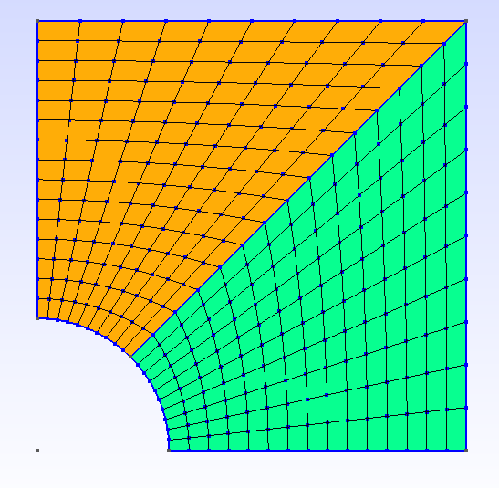
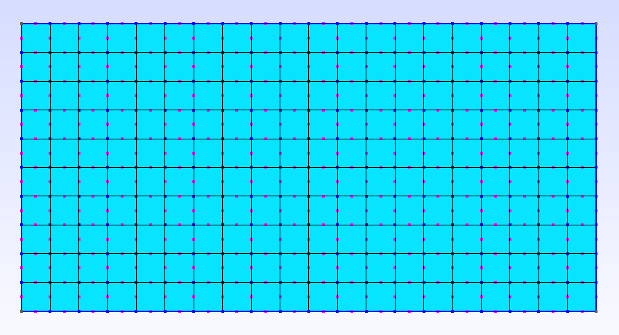

# Mallas 2D creadas con GMSH utilizando el lenguaje nativo del programa (formato .geo)

### Ejemplo #1: Malla 2D no estructurada con un agujero en la mitad

### Ejemplo #2: Malla 2D estructurada usando las funciones *Transfinite Curve* y *Transfinite Surface*

### Ejemplo #3: Malla 2D estructurada usando la función *extrude*

### Ejemplo #4: Malla de elementos Shell estructurada, para el problema *Scordelis lo roof*

### Ejemplo #5: Malla de elementos Shell estructurada para el problema *Twisted beam*

